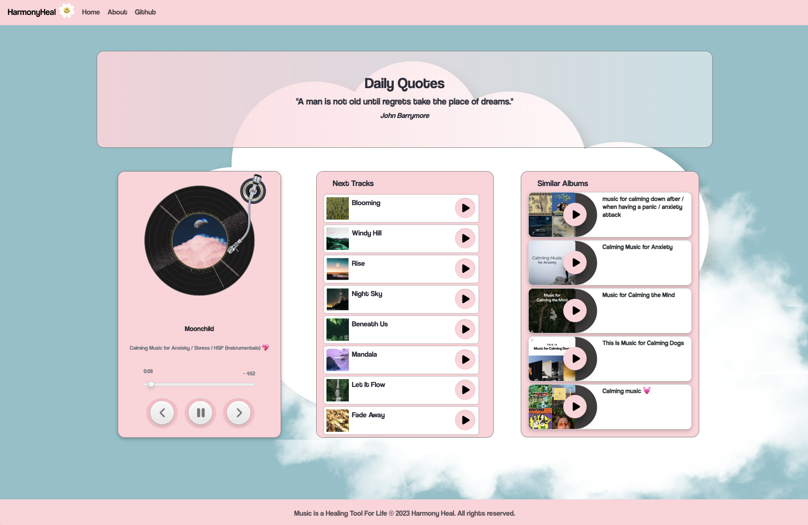
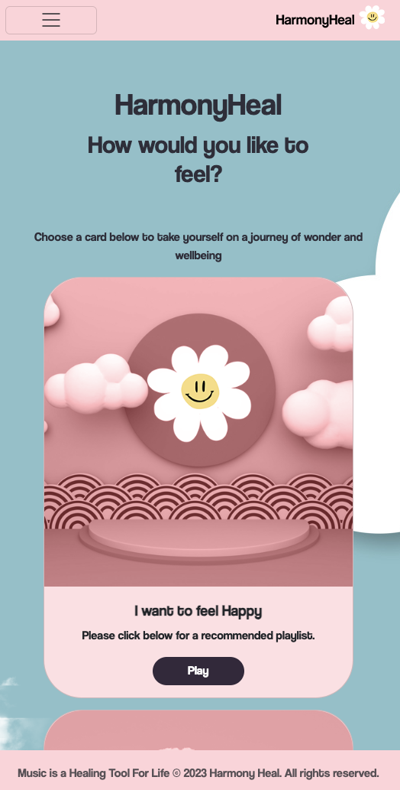

# HarmonyHeal
Harmony Heal is website to help users manage their emotions and mental health through music. 

## Deployed Project Link
- **Visit** the application at: https://gsgghotra.github.io/HarmonyHeal/

## Table of Contents

1. [Introduction](#introduction)
2. [Features](#features)
3. [Screenshots](#screenshots)
4. [Credits](#credits)

## Introduction 
Harmony Heal is website to help users manage their emotions and mental health through music. 

The website has been developed with wellbeing in mind and aims to be a simple to use tool that can be accesed by carers or users who want to listen to different music playlists depending on how they are feeling.

## Features 

- Custom Playlists
- Recommended Albums based on the chosen card
- Fully functional music player
- Huge collection of playlists (From Spotify)

## Screenshots
- **Home Screen**:

- **Music Player**:

- **Mobile First Design**:

## Credits

- We have used 2 API's for this project. (Spotify and API Ninjas)

#### Contributors:
- Arion mehmeti
- Gurjeet Singh
- John Skidmore
- Simon Tsang

